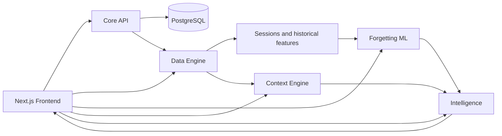

# ContextIQ

> **ContextIQ uses behavioural event data to identify recurring patterns of forgetting, context switching and daily friction, predicts potential forgetting risk using explainable ML, and converts those patterns into evidence-based proactive recommendations.**

ContextIQ is a portfolio project for exploring the full path from event data to usable intelligence: ingestion, temporal feature engineering, leakage-safe ML, session analytics, association mining, APIs, and a frontend workflow.

## The Problem

Traditional task tools record what a person intends to do. They usually do not explain why tasks are repeatedly forgotten, which contexts create friction, how interruptions affect recovery, or what "one more thing" tends to accompany a task.

ContextIQ models those observable patterns from explicit task and behavioural events. It is designed to help a person notice recurring friction while a task is still actionable.

## Why It Is Not Just a Todo App

The core object is not a task card; it is a time-ordered behavioural record. ContextIQ reconstructs sessions, computes historical features, detects context switching, estimates recovery cost, mines repeated task associations, predicts forgetting risk, and explains the evidence behind recommendations.

It does not claim to infer psychology or diagnose a person. It works with observable application events and clearly labels synthetic-data and model limitations.

## What the System Detects

| Capability | Approach |
|---|---|
| Forgetting risk | Logistic Regression, Random Forest, and XGBoost candidates with calibration and SHAP explanations |
| Context switching | Ordered event/session reconstruction and context-switch metrics |
| Daily friction | Interruption, recovery, forgetting, workload, and switching composites |
| Context associations | FP-Growth/Apriori-style frequent itemsets and association rules |
| Recommendations | Quality-filtered, de-duplicated, cooldown-aware ranking |
| Human-readable insights | Structured evidence aggregation with mock or optional server-side LLM provider |

## Architecture



Services run on ports 8000-8004, with the frontend on 3000. The full diagram, boundaries, and deployment model are in [docs/ARCHITECTURE.md](docs/ARCHITECTURE.md).

## Data and Pipeline

The system works with explicit users, tasks, task lifecycle events, interruptions, locations/contexts, and reconstructed sessions. A raw event represents a timestamped transition or interruption; it is not a recording of keystrokes, messages, audio, or screen activity.

The pipeline validates and cleans records, orders events, reconstructs sessions, computes analytics, builds leakage-safe task features, exports a temporal ML dataset, trains models, and produces quality reports. Every feature for task `T` uses only records strictly before `T.created_at`; the eventual task status is used only as the label.

See [docs/DATA_PIPELINE.md](docs/DATA_PIPELINE.md) and [docs/FEATURE_DICTIONARY.md](docs/FEATURE_DICTIONARY.md).

## ML Methodology

The target is `will_forget`: whether a task eventually reaches the forgotten state. Logistic Regression provides an interpretable baseline, Random Forest tests non-linear interactions, and XGBoost tests gradient boosting for tabular data. Models are evaluated with chronological train/validation/test splits and walk-forward validation.

PR-AUC is prioritized over accuracy because forgetting is the minority class. Validation threshold tuning supports the intended operating point, while Brier score and calibration checks make probability output more meaningful. SHAP or model-native fallback explanations show associated contributing features, never causal or clinical claims.

See [docs/ML_METHODOLOGY.md](docs/ML_METHODOLOGY.md) and the detailed [forgetting-ml methodology](forgetting-ml/docs/MODEL_METHODOLOGY.md).

## Setup

### Docker Compose

```bash
copy .env.example .env
```

Set `POSTGRES_PASSWORD` and `SECRET_KEY` in `.env`. Keep the file local and use a secret manager for real deployment.

```bash
docker compose config --quiet
docker compose up --build
```

Open `http://localhost:3000`. API docs are available at:

| Service | URL |
|---|---|
| Frontend | http://localhost:3000 |
| Core API | http://localhost:8000/docs |
| Data Engine | http://localhost:8001/docs |
| Forgetting ML | http://localhost:8002/docs |
| Context Engine | http://localhost:8003/docs |
| Intelligence | http://localhost:8004/docs |

See [docs/SETUP.md](docs/SETUP.md) and [cmd.md](cmd.md) for manual setup and operational commands.

## Recruiter Demo

1. Start Docker Compose and open the dashboard.
2. Inspect tasks and lifecycle events.
3. Open predictions to show risk probability, model version, and contributing features.
4. Open context intelligence to show sessions, interruptions, switches, and recovery cost.
5. Open recommendations to show association-derived "one more thing" suggestions.
6. Open insights to show structured evidence rendered as a human-readable explanation.
7. Open the API docs and the architecture/methodology pages to connect the UI to the engineering decisions.

The detailed walkthrough is [docs/DEMO.md](docs/DEMO.md).

## API Documentation

The API map and service contracts are in [docs/API.md](docs/API.md). Each FastAPI service publishes OpenAPI documentation at `/docs` while running.

## Testing

Frontend checks:

```bash
cd frontend
npm ci
npm test
npx tsc --noEmit
npm run lint
npm run build
```

Python service checks should be run from each service directory because they have independent dependencies and fixtures:

```bash
cd backend && pytest -q
cd data-engine && pytest -q
cd forgetting-ml && pytest -q
cd context-engine && pytest -q
cd intelligence && pytest -q
```

See [docs/TESTING.md](docs/TESTING.md) for the test strategy and production gate.

## Technology Stack

Next.js, React, TypeScript, FastAPI, Pydantic, SQLAlchemy, Alembic, PostgreSQL, pandas, NumPy, scikit-learn, XGBoost, SHAP, joblib, association mining, Docker Compose, and Vitest.

## Limitations and Responsible Use

The current data is synthetic and does not establish real-world predictive validity. The development identity header is not production authentication. Model explanations are associations, not causes. ContextIQ must not be used for medical, employment, academic, credit, or other consequential decisions.

Read [docs/LIMITATIONS.md](docs/LIMITATIONS.md) and [docs/PRIVACY.md](docs/PRIVACY.md) before presenting the project as a real-user product.

## Project Overview

For a one-page summary of objectives, architecture, engineering decisions, challenges, limitations, and roadmap, see [PROJECT_OVERVIEW.md](PROJECT_OVERVIEW.md).
