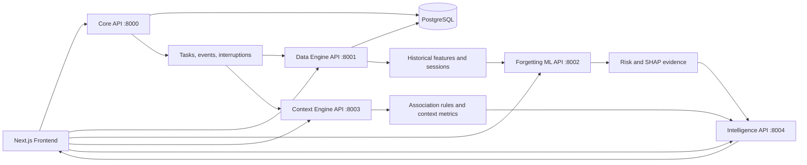

# ContextIQ Architecture

## System View

## Service Responsibilities

| Service | Responsibility | Primary persistence/output |
|---|---|---|
| Frontend | Dashboard, tasks, predictions, insights, recommendations | Browser state and API calls |
| Backend | Core CRUD, user-scoped authorization boundary, health, database access | PostgreSQL |
| Data Engine | Ingestion analytics, validation, cleaning, sessions, features, quality reports | SQLite/PostgreSQL and exported feature files |
| Forgetting ML | Feature contract, model training, inference, calibration, SHAP explanations | Versioned model artifacts |
| Context Engine | Session reconstruction, context metrics, association mining, recommendations | In-memory/cache state and CSV demo artifacts |
| Intelligence | Structured insight aggregation, recommendation ranking, optional LLM explanation | Structured response objects |

## Request and Data Flow

1. A task or behavioural event is submitted through an API.
2. The core/data service validates types, timestamps, IDs, and user ownership.
3. Historical data is transformed into sessions and analytical aggregates.
4. The ML service consumes a versioned feature contract and returns a probability, risk band, model version, and explanation features.
5. The context engine mines repeated task combinations within a context.
6. The intelligence service receives structured evidence and produces bounded recommendations or explanations.
7. The frontend renders the result with explicit loading, empty, error, and retry states.

## Trust Boundaries

- Client-provided user IDs are development-only. Production must use verified bearer tokens/OIDC claims.
- API keys are server-side environment variables and are never sent to the browser.
- The intelligence layer receives structured evidence, not unrestricted raw event history.
- Database queries use SQLAlchemy expressions rather than string-concatenated SQL.
- Model artifacts are checked for required fields and runtime version compatibility before serving.

## Deployment

Docker Compose starts PostgreSQL first, then health-gated APIs, then the frontend. Database migrations run before backend startup and fail the container if they fail. Secrets are supplied through `.env` or a deployment secret manager; `.env.example` contains placeholders only.
